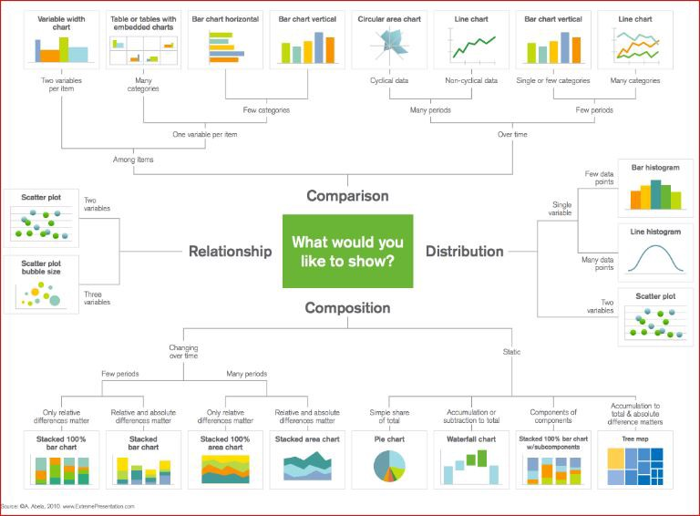

# Data-Visualizations-In-Python-Pandas
Python offers several plotting libraries, namely Matplotlib, Seaborn and many other such data visualization packages with different features for creating informative, customized, and appealing plots to present data in the most simple and effective way.

